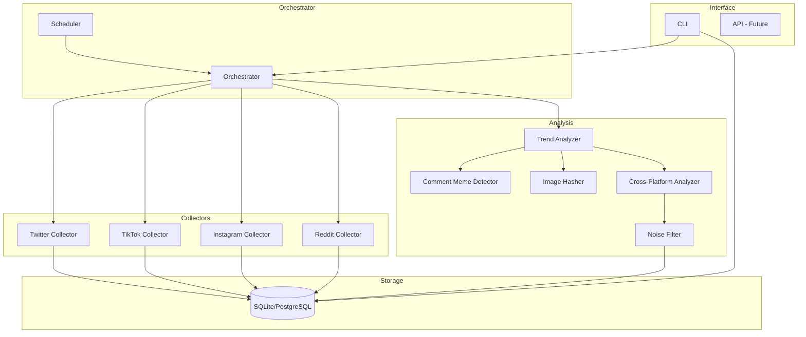
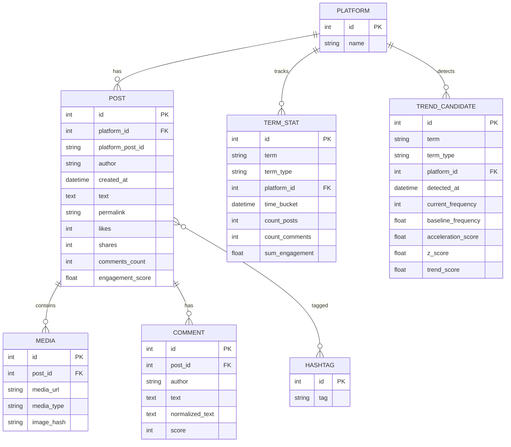

# Meme Radar - Architecture Documentation

## System Overview



## Data Flow

### 1. Collection Phase

```
Scheduler (every 30 min)
    ↓
Orchestrator.run_collection()
    ↓
┌─────────────────────────────────────────┐
│ For each enabled platform:              │
│   1. Collector.collect()                │
│   2. Returns CollectionResult with:     │
│      - PostEvent[]                      │
│      - CommentEvent[]                   │
│   3. Orchestrator._persist_result()     │
│      - Upsert posts                     │
│      - Link hashtags                    │
│      - Store media URLs                 │
│      - Store comments                   │
└─────────────────────────────────────────┘
```

### 2. Analysis Phase

```
Orchestrator.run_analysis()
    ↓
TrendAnalyzer.update_term_stats()
    ↓ Aggregate into TermStat records
TrendAnalyzer.detect_trends()
    ↓ Calculate frequency, acceleration, z-score
NoiseFilter.filter_trends()
    ↓ Remove stop phrases, evergreen hashtags
TrendAnalyzer.save_trend_candidates()
    ↓
CommentMemeDetector.detect()
    ↓ Find repeated phrases across posts
TemplateDetector.detect_templates()
    ↓ Find repeated image hashes
CrossPlatformAnalyzer.analyze()
    ↓ Boost multi-platform trends
    ↓
Results stored in TrendCandidate table
```

## Data Model



## Trend Detection Algorithm

### Frequency Analysis

For each term (hashtag, phrase, or image hash):

1. **Bucket** data into 30-minute windows
2. **Count** occurrences in current window
3. **Calculate baseline** from previous N windows (mean + std)

### Acceleration Score

```
acceleration = (current_frequency + 1) / (baseline_frequency + 1)
```

- > 3.0 = Strong acceleration (potential trend)
- > 10.0 = Viral spike

### Z-Score

```
z_score = (current - baseline_mean) / baseline_std
```

- > 2.0 = Statistically significant
- > 3.0 = Strong anomaly

### Trend Criteria

A term is flagged as trending if:
- `frequency >= min_frequency` (default: 10)
- `z_score >= threshold` (default: 2.0) OR `acceleration >= threshold` (default: 3.0)
- `engagement >= min_engagement` (default: 5)

## Platform Collectors

| Platform | Library | Data Collected |
|----------|---------|----------------|
| Twitter/X | snscrape | Tweets, hashtags, media, engagement |
| TikTok | TikTokApi | Trending videos, comments, engagement |
| Instagram | Instaloader | Posts by hashtag/account, comments |
| Reddit | PRAW | Rising/new posts, comments, scores |

### Standardized Output

All collectors return:

```python
@dataclass
class PostEvent:
    platform: str
    platform_post_id: str
    author: str
    created_at: datetime
    text: str
    hashtags: list[str]
    media_urls: list[tuple[str, str]]
    likes: int
    shares: int
    comments_count: int
    engagement_score: float
```

## Image Hashing

Uses **pHash (perceptual hash)** from the `imagehash` library:

1. Resize image to 32x32
2. Convert to grayscale
3. Apply DCT (Discrete Cosine Transform)
4. Extract top-left 8x8 of DCT
5. Compute median and generate binary hash

### Similarity Detection

- Identical hashes = Same image
- Hamming distance ≤ 10 = Same meme template

## Noise Filtering

### Stop Phrases
Generic reactions filtered out:
- "lol", "lmao", "omg"
- "link in bio", "subscribe"

### Evergreen Hashtags

Always-popular tags (filtered unless extreme spike):
- #love, #happy, #fashion

### Spam Detection

- Single-author content
- Promotional patterns (discount, sale, etc.)
- Very short phrases

## Future Extensions

### AI Integration Points

1. **Classification**: Add LLM classification to `TrendCandidate`
2. **Explanation**: Generate meme explanations
3. **Prediction**: Predict viral potential

### Additional Platforms

- YouTube (comments on trending videos)
- Discord (public server messages)
- 4chan archives

### Scaling

- Migrate SQLite → PostgreSQL
- Add Redis for caching
- Distribute collectors
